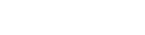
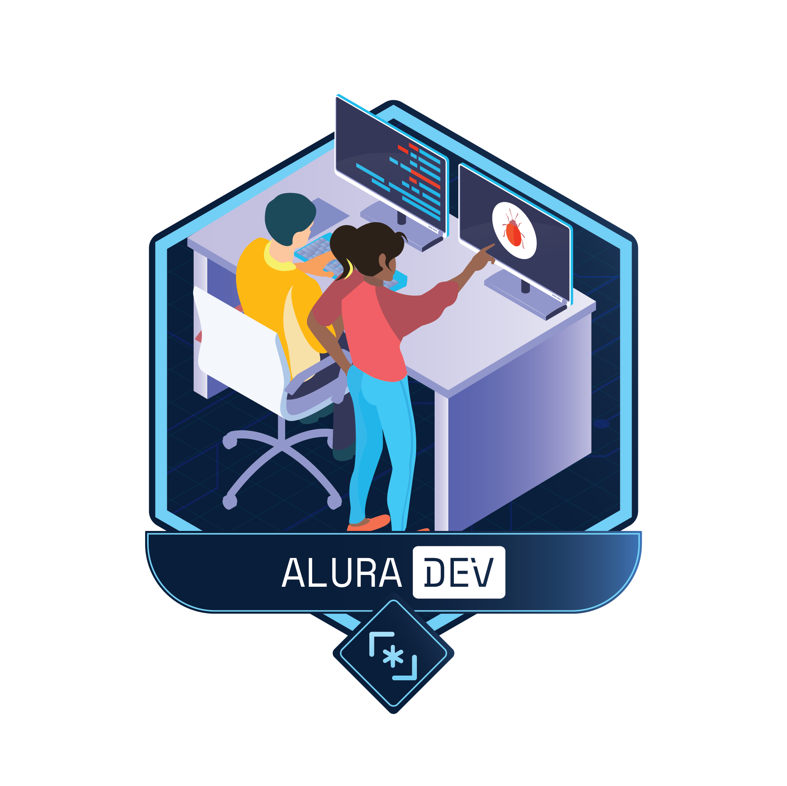
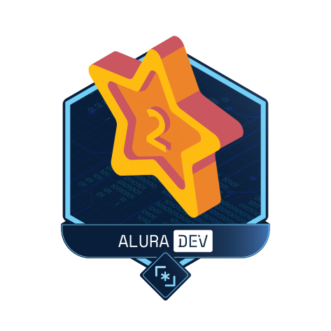
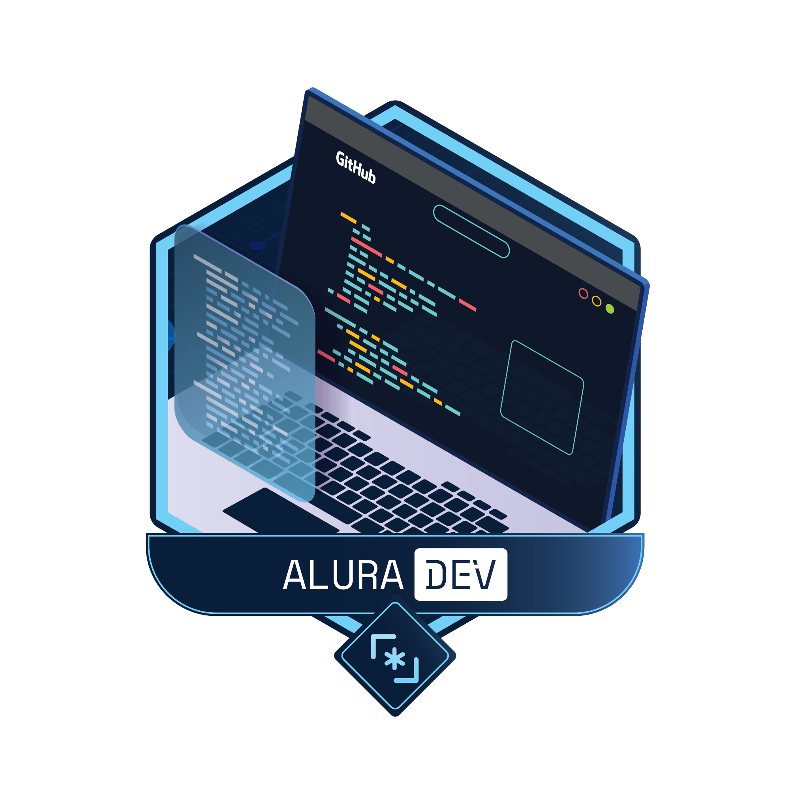

<h1 align="center">
  
</h1>

  

<h2>👨‍💻 Sobre</h2>

Projeto desenvolvido durante o Alura Challenge Front End, realizado pela Alura exclusivo para seus alunos, para que eles possam colocar em prática os conceitos aprendidos nos cursos. O AluraDev é um site para escrever pequenos trechos de código, com o objetivo de ajudar desenvolvedores e desenvolvedoras a compartilhar suas soluções com outras pessoas. Você pode acessar o site do projeto clicando neste link: <a href="https://matheus-pazinati.github.io/alura-dev-challenge/">Site da AluraDev</a>

 
<h2>🎯 Objetivo</h2>

Simular a criação de um projeto no dia a dia de uma empresa de tecnologia, utilizando a plataforma Trello para organizar as tarefas a serem executas, trabalhando em conjunto com outras pessoas, perguntando e tirando dúvidas, realizando reuniões semanais na plataforma Zoom para fazer um acompanhamento do projeto, entendendo as dificuldades e planejando os próximos passos. Além disso, este é o primeiro projeto que utilizo o Local Storage para armazenar os dados do usuário da plataforma, e também a utilização de algumas bibliotecas para ajudar no desenvolvimento.

 
<h2>🚀 Tecnologias utilizadas</h2>
<ul>
  <li>HTML</li>
  <li>CSS</li>
  <li>Javascript</li>
</ul>
<h3>📚 Bibliotecas</h3>
<ul>
  <li><a href="https://highlightjs.org/">HighlightJS</a></li>
  <li><a href="https://github.com/tsayen/dom-to-image">Dom-to-Image</a></li>
  <li><a href="https://github.com/eligrey/FileSaver.js/">FileSaverJS</a></li>
  <li><a href="https://sweetalert2.github.io/">SweetAlert2</a></li>
</ul>
 
<h2>🏷️ Layout</h2>

Você pode visualizar o layout do projeto através deste link: <a href="https://www.figma.com/file/Ve4hpTfmMa7yAFneoGtGKD/Projects?node-id=17%3A3367&viewport=86%2C-1148%2C0.3736729025840759">Layout do projeto</a>. É necessário possuir uma conta no <a href="https://figma.com">Figma</a> para acessá-lo.

 
<h2>🎖️ Insígnias</h2>
  
Insíginas recebidas da Alura após o cumprimento de alguns objetivos no evento.
  

    
    
    
  

   
   

Made by Matheus Pazinati 🛸

